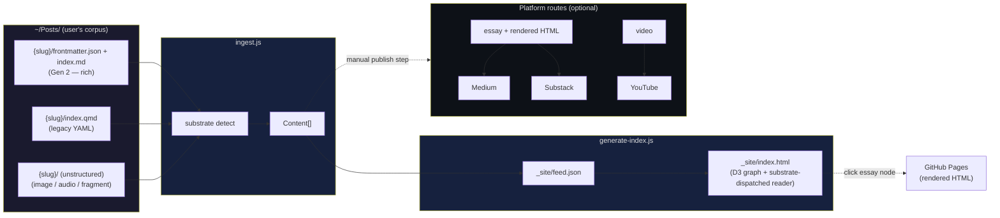

# post-pipe Architecture & Design Decisions

**Last updated:** 2026-04-18

---

## What This Is

post-pipe is a **corpus viewer with optional publishing routes** — not a blog pipeline.

You point it at a folder (`~/Posts/` by default). It walks the folder, detects what kind of content each subfolder contains (essay, image, audio, video, multi-substrate work, archive, fragment), and produces a spatial graph view of your entire intellectual topology. When a piece is text and wants to travel, publishing routes exist for GitHub Pages / Medium / Substack / YouTube / etc. — but publishing is a *capability*, not the purpose.

Metadata is a gradient, not a gate. Folders with rich `frontmatter.json` produce rich nodes (topology, energy, forms, explicit edges). Folders with legacy `.qmd` YAML read in a lossy mode. Folders with nothing but a PNG or an unplaced `.md` still appear — labeled `scattered` with a TODO for metadata.



---

## Content Model

Every folder in `~/Posts/` becomes one `Content` object. The object shape is shared across all schemas; missing fields default gracefully.

```js
{
  id:            "art-is-pattern",                 // folder name
  kind:          "essay",                          // essay | image | podcast-episode |
                                                   // video | multi | archive | fragment
  title:         "Art Isn't Magic. It's Complexity.",
  short_title:   "Art Is Pattern",
  summary:       "...",                            // idea.tldr || idea.seed

  // Rich metadata (Gen 2 only — null/empty for legacy and unstructured)
  seed:          "...",                            // genesis sentence
  topology:      ["information-theory", ...],      // structural patterns (NOT keywords)
  energy:        "peak" | "sunset" | "any" | null, // Harold's dopamine-cycle signal
  substrate:     "essay",                          // current embodiment

  // Publication state
  status:        "scattered" | "drafted" | "bloomed" | "published",
  written:       "2025-12-01" | null,
  syndication:   { canonical, medium, substack, github_pages, ... },

  // Substrate potential (Gen 2)
  forms_current: "essay",
  forms_potential: ["podcast-episode", "workshop-for-makers", ...],
  forms_companions: ["cover-image"],               // only for kind: "multi"

  // Topology edges (Gen 2)
  connected_to:  ["append-only-mind", "egregores_magosphere"],

  // Resolved paths
  cover:         "images/cover.png" | null,        // relative to content folder
  body:          { file: "index.md", format: "md" } | null,
  media:         { audio: {file, srt, transcript, timings} } | null,

  // Operational
  todos:         ["_TODO-MIGRATE.md"],             // files triggering human review
  source:        "local",                          // vs "feed:aeon" for RSS nodes
  schema:        "gen2" | "legacy-qmd" | "unstructured"
}
```

The ingester in [`ingest.js`](./ingest.js) produces these objects. It's metadata-graceful: missing frontmatter never excludes a folder. Substrate detection falls back to file-extension inspection when no explicit `idea.substrate` is declared.

---

## Content Schema Generations

Three schemas coexist in `~/Posts/`. The ingester reads all three.

### Gen 2 — `frontmatter.json` + `index.md` (canonical, preferred)

Rich, topologically-native. Encodes the structure Harold actually thinks in.

```json
{
  "id": "art-is-pattern",
  "title": "Art Isn't Magic. It's Complexity.",
  "short_title": "Art Is Pattern",

  "idea": {
    "seed": "The 'substance' of a thing is its pattern — its information...",
    "tldr": "Art and math are neighbors on one street called pattern...",
    "topology": ["information-theory", "philosophy-of-art", "pattern-substrate-invariance"],
    "energy": "peak",
    "substrate": "essay"
  },

  "meta": {
    "author": "harold young [humxn]",
    "written": "2025",
    "updated": null,
    "reading_time": "6 min",
    "status": "bloomed",
    "license": "CC-BY-SA 4.0"
  },

  "forms": {
    "current": "essay",
    "potential": ["illustrated-lecture", "podcast-episode", "workshop-for-makers"]
  },

  "tags": ["art", "AI", "pattern", "philosophy"],
  "syndication": { "canonical": null, "medium": null, "substack": null, ... },
  "connected_to": ["append-only-mind", "egregores_magosphere"],
  "note": "Optional internal note"
}
```

**`idea.topology` ≠ `tags`.** Tags are subject-matter keywords. Topology is substrate-independent structural pattern — the *shape* of the idea, not its topic. Typical topology labels: `labor-power`, `pattern-substrate-invariance`, `erasure-of-expertise`, `epistemic-colonialism`, `negative-evidence`, `wu-wei`.

**`meta.status` vocabulary:**
- `scattered` — raw thoughts, notes, fragments
- `drafted` — written out but rough
- `bloomed` — essentially finished, internal satisfaction (may not be publicly posted)
- `published` — publicly posted (with `syndication.*` filled in)

The graph today treats `bloomed` and `published` the same visually (finished work). `drafted` and `scattered` render as drafts.

**`forms`** encodes substrate-independence. `potential` lists realistic other-substrate forms this idea could take. For `kind: "multi"` (podcast + companion essay + cover art of the same idea), `companions` lists the co-present substrates.

### Gen 1 — `index.qmd` (legacy, read-only for ingester)

Single-file Quarto/Markdown with YAML frontmatter. Ingester reads these in a lossy mode — no `seed`, no `topology`, no `energy`, no `connected_to`. Each Gen 1 folder has a `_TODO-MIGRATE.md` file with migration instructions specific to that article (auto-extracted YAML + fields needing human judgment).

Field mapping from Gen 1 → Gen 2 is documented in [`~/Posts/_MIGRATION-GUIDE.md`](../Posts/_MIGRATION-GUIDE.md).

### Gen 0 — unstructured

Folders that contain content but no structured metadata. Ingester detects substrate by file mix:

| files present | detected kind |
|---|---|
| any `.m4a` / `.mp3` | `podcast-episode` |
| any `.mp4` / `.mov` | `video` |
| any `.md` / `.qmd` / `index.html` | `essay` |
| only `.jpg` / `.png` / `.webp` | `image` |
| multiple substrates | `multi` |
| nothing recognizable | `fragment` |

Each Gen 0 folder gets a `_TODO-METADATA.md` with a research checklist. Full procedure in [`~/Posts/_METADATA-GUIDE.md`](../Posts/_METADATA-GUIDE.md).

---

## The Viewer

The generated `_site/index.html` is a self-contained page with:

1. **D3 force-directed graph** — nodes are content items; edges are tag co-occurrence (and in future: explicit `connected_to` edges, substrate clusters)
2. **Reader panel** — slides in on node click; dispatches rendering based on `content.kind`
3. **TTS toolbar** — engine-agnostic registry (browser / kokoro / supertonic / gemini)
4. **Syndication toolbar** — platform icons linking to cross-posted versions

### Substrate dispatch in the reader

`renderSubstrate(article, body, headerHTML)` routes to:

- `essay` / `multi` — `fetch({pages_url})` and inject HTML (existing path)
- `image` — `` inline with the cover URL
- `podcast-episode` / `video` / `archive` / `fragment` — placeholder box + metadata summary (until per-substrate renderers are built)

Metadata rows (`seed`, `tldr`, `topology`, `energy`, `note`) render below the body for non-essay kinds so the reader never sees a blank panel.

---

## Text-to-Speech System

The viewer integrates a TTS module (`tts.js`) for multilingual accessibility. Engine-agnostic: engines self-register at load, advertise capabilities, and are lazy-loaded on first play.

### Registry Pattern

```javascript
window.TTS.register(engineName, {
  init(),          // Called once when selected + played
  speak(text),     // Async; returns Promise
  pause(), resume(), stop(),
  capabilities()   // { voice, speed, pitch, quality, language, ... }
});
```

### Engines

- **Browser (Web Speech API)** — instant, OS-native voices
- **Kokoro-82M** — 53 voices, 9 languages, ~82MB on first play
- **Supertonic** — 10 voices, 5 languages, ~66MB
- **Google Gemini** — 30 multilingual voices via API

### Highlighting principle

Sentence highlighting in the viewer is **ambient confirmation, not wayfinding** — the text itself pulses at the reading rate without demanding attention. No sidebar progress, no karaoke, no forceful scroll. Current implementation dwells-then-fades from API latency accident; the sidecar-timings path (see [`research/TTS Highlighting_ Chunking vs. Sentence Mode.md`](research/)) will lift that aesthetic into a deterministic spec (400ms fade, 150ms look-ahead gap, 200ms paragraph-first dwell).

This principle is load-bearing and must survive all future TTS work.

---

## GitHub Pages

- Repo: `halapenyoharry/haroldyoung-human-posts`
- Pages URL: `https://halapenyoharry.github.io/haroldyoung-human-posts/`
- Auth token in `auth/.env` (gitignored)

For essays, the push flow is:
1. `quarto render index.qmd --to html -M embed-resources:true` (for legacy folders)
   — or —
   future `render.js` step for Gen 2 `.md` → self-contained HTML
2. `pushArticle()` in `platforms/github-pages.js` uploads `{slug}.html`
3. `node generate-index.js` rebuilds `feed.json` + `index.html` from `~/Posts/`
4. `pushFile()` uploads those to Pages root

Non-essay substrates (image/audio/video) will get their own push paths as renderers are added.

---

## RSS / JSON Feed

`_site/feed.json` is JSON Feed 1.1 compatible, extended with the rich content model (`kind`, `substrate`, `seed`, `topology`, `energy`, `forms`, `connected_to`, `todos`). Standard feed readers ignore unknown fields; the viewer consumes all of them.

The D3 graph fetches `feed.json` at load and derives its shape client-side. `feed.json` is the single source of truth; the graph is a view.

External feeds (Aeon, ProPublica, etc.) can be toggled in [`settings.json`](./settings.json) `feeds[]`. When enabled, RSS items are ingested via `platforms/feed-ingester.js` and appear as peer nodes in the graph — curated external reading alongside your own corpus. (Currently all external feeds are `enabled: false`.)

---

## Adaptive Execution Flow (AI Operation Model)

post-pipe is designed for AI operation using the **Adaptive Execution Flow** pattern:

> **Act or Ask.** The AI handles all mechanical labor autonomously. When it hits a structural barrier (paywall, CAPTCHA, changed layout, missing credentials), it stops and escalates with the exact reason and a single specific request for what it needs to proceed.

Core rules:
1. Attempt autonomous execution first
2. Identify structural barriers exactly — do not guess or hallucinate workarounds
3. Escalate with precision: state the exact mechanical reason for failure
4. Demand specific input: one thing, one ask
5. Resume immediately from the point of failure once unblocked

The article [`the-collaborator-that-acts-or-asks`](../Posts/the-collaborator-that-acts-or-asks/) *is* this protocol.

---

## Current Platform Status

| Platform | Status | Notes |
|----------|--------|-------|
| GitHub Pages | ✅ Working | Push via GitHub API |
| Medium | ⚠️ Partial | Push works; Playwright import step manual |
| Substack | ⏳ Stub | Not implemented |
| YouTube | ⏳ Stub | Not implemented |

Platform modules are substrate-aware in principle but not yet in code: essay → Medium/Substack/LinkedIn; video → YouTube; image → social posts. Routing will be explicit once a non-essay push path is built.

---

## Known Issues / Work in Progress

- **`post-pipe/articles/`** — the old content root, retained in `archive/` for reference. All active content lives in `~/Posts/`.
- **Quarto rendering** still the path for Gen 1 legacy articles. A native `.md` → self-contained HTML renderer is planned to remove the Quarto dependency for Gen 2.
- **Substrate renderers** beyond `essay` and `image` are placeholders. Audio/video renderers need media-file copy paths into `_site/` or CDN routing.
- **Prepared-audio + sidecar timings pipeline** (see plan in conversation history) — phase 1 is `prepare-audio.js` that synthesizes sentence-by-sentence at publish time and emits `audio.mp3` + `timings.json`. Bypasses forced alignment entirely.
- **Medium import** — `medium.com/p/import` URL is dead. Correct path: `medium.com/me/stories` → "Import a story" button. Playwright step needs updating.
