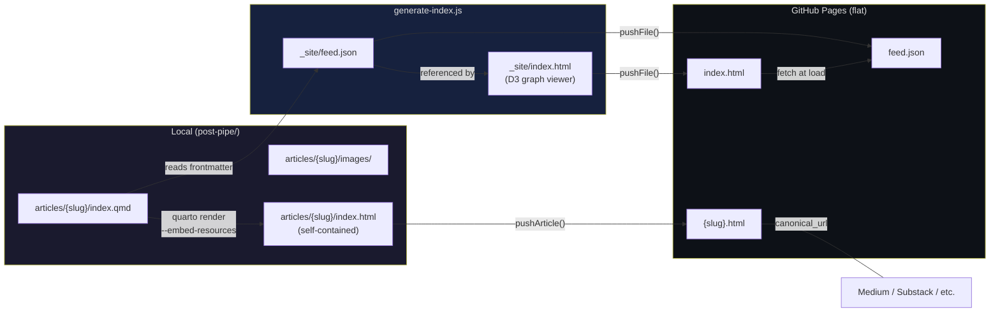

# post-pipe Architecture & Design Decisions

**Last updated:** 2026-04-05

---

## What This Is

A markdown-to-platform publishing pipeline. You write once, it pushes everywhere.



Current working flow:
1. Write article as `.qmd` with frontmatter in `articles/{slug}/`
2. `quarto render index.qmd --to html -M embed-resources:true` — self-contained HTML
3. Push `{slug}.html` to GitHub Pages via `pushArticle()` in `platforms/github-pages.js`
4. `node generate-index.js` — rebuilds `feed.json` + `index.html` (D3 graph) from article frontmatter
5. Push `index.html` + `feed.json` to GitHub Pages
6. Cross-post to platforms using the canonical GitHub Pages URL

---

## Article Format: Quarto (.qmd)

We are moving toward **Quarto** as the article format. It is Markdown + YAML frontmatter + support for inline code blocks that generate charts, Mermaid diagrams, and figures. Outputs to HTML, PDF, Word, EPUB.

Why Quarto over plain `.md`:
- Charts and graphs can be generated inline from source data (Python/R/JS blocks)
- Mermaid diagrams render to PNG on export
- Self-contained compilation: one command produces the full deliverable
- PDF export is clean without external tooling

---

## Folder-Per-Article Structure

Each article is a self-contained folder — the spiritual successor to macOS `.rtfd` bundles (folder pretending to be a file, images embedded inside). Images are not in a shared flat assets pool; they belong to the document.

```
articles/
  why-you-need-ai-insurance/
    index.qmd           ← article text + frontmatter
    images/
      cover.jpg         ← cover + og:image
      revenue-chart.png
    data/
      revenue-chart.csv ← source data for charts
    chart.mermaid       ← diagram source (renders on export)
```

---

## Article Frontmatter Schema

```yaml
---
title: ""                    # full title
short_title: ""              # 2-3 words, used in graph nodes
slug: ""                     # filename on GitHub Pages

description: ""              # preview text, og:description
tldr: ""                     # one sentence summary

author: "Harold Young"
publish_date: ""             # YYYY-MM-DD
updated_date: ""
reading_time: ""             # estimated minutes
tags: []                     # freeform; scan all articles to see existing tags

series: ""
series_part:

cover_image: "images/cover.jpg"
og_image: "images/cover.jpg"

canonical_url: ""            # final published URL (GitHub Pages)
license: ""                  # CC-BY-SA 4.0, etc.

syndication:
  medium: ""                 # URL where cross-posted
  substack: ""
  bluesky: ""
  youtube: ""
  linkedin: ""
  hackernews: ""
  reddit: ""

status: draft                # draft, published, archived

---
```

**canonical_url** is always the GitHub Pages URL. This is the source of truth. Every platform you cross-post to receives this as the canonical, which prevents Google duplicate content penalties. Medium and Substack both honor the canonical field.

**syndication** is a record of where the article has been published. The `.qmd` file becomes the single source of truth for syndication state.

**updated_date** + git commit log = amendment history. At build time, inject the git log into the HTML footer:
```bash
git log --follow --pretty="%h %ad %s" articles/slug/index.qmd
```

---

## GitHub Pages

- Repo: `halapenyoharry/haroldyoung-human-posts`
- Pages URL: `https://halapenyoharry.github.io/haroldyoung-human-posts/`
- Auth token: stored in `auth/.env` (gitignored)

Push logic in `platforms/github-pages.js`: `pushArticle()` uploads a self-contained HTML file as `{slug}.html` (flat, no subdirectories). `pushFile()` uploads arbitrary files (used for `index.html` and `feed.json`).

---

## RSS / JSON Feed

GitHub Pages serves a static JSON Feed (`jsonfeed.org/version/1.1`). Generated by `node generate-index.js` from article frontmatter → `_site/feed.json` → pushed to GitHub Pages root.

The `index.html` (D3 force-directed graph) fetches `feed.json` at load time and derives the graph client-side. feed.json is the single source of truth — the graph is a view of it.

---

## Viewer & Text-to-Speech System

The graph viewer (`_site/index.html`) includes an integrated text-to-speech (TTS) module (`tts.js`) for multilingual accessibility. The system is engine-agnostic: it discovers available engines at runtime, adapts the UI to each engine's capabilities, and defers model initialization until the user selects an engine and presses play (lazy loading).

### TTS Registry Pattern

The core interface is `window.TTS`, a registry where engines self-describe:

```javascript
window.TTS.register(engineName, {
  init(),          // Called once when selected + played
  speak(text),     // Async; returns Promise
  pause(),
  resume(),
  stop(),
  capabilities()   // Returns descriptor object
});
```

Engines never load or initialize until explicitly selected. When an engine is selected:
1. `capabilities()` is called to ask "what parameters do you support?"
2. The UI dynamically renders controls (sliders for range params, dropdowns for choices)
3. On first play, `init()` downloads models asynchronously
4. Parameters are passed to `speak()` via `TTS.set(key, value)`

### Built-in Engines

**Browser (Web Speech API)**
- Instant, no download required
- Device-native voices (OS-dependent)
- Parameters: `speed` (0.5–3), `pitch` (0–2), `volume` (0–1), `voice` (native list)
- Single language per voice (mix/match as needed)

**Kokoro-82M** (Local inference via Transformers.js worker)
- High quality, 53 voices across 9 languages
- Languages: English, Spanish, French, German, Italian, Portuguese, Dutch, Chinese, Japanese
- Voice naming: `{country}_{gender}_{name}`, e.g., `en_af_tilly` (US English, female)
- Parameters: `speed` (0.8–1.2), `quality` (fp32/q8/q4 quantization)
- First play: downloads 82MB model (cached in browser IndexedDB)

**Supertonic** (ONNX inference via Web Workers)
- Medium quality, 10 voices, 5 languages
- Explicit language parameter: `en`, `ko`, `es`, `pt`, `fr`
- Parameters: `speed` (0.5–2), `quality` (totalStep 1–50), `language`
- Lightweight (~66MB on first load)

### Scroll-Sync & Sentence Highlighting

The viewer extracts sentences from article text by walking the DOM and splitting on sentence boundaries. When TTS plays:
- Current sentence is wrapped in `<mark class="tts-active">` (green highlight)
- Parent container auto-scrolls to keep the active sentence in the top third
- On pause/resume, highlighting persists at the correct position
- On stop, highlighting is cleared

Implemented in `tts.js`:
- `extractSentences()` — walks DOM, returns array of `{text, node, nodeIndex}`
- `highlightSentence(index)` — wraps in marker, scroll-syncs container
- `speakNext()` — async generator that maintains playback state across all engine types

### Capability-Driven UI (generate-index.js)

The toolbar dynamically builds controls based on the selected engine:

```javascript
wireTTS() {
  // Populate engine dropdown from TTS.engines()
  // Listen for engine selection → call capabilities()
  // Render controls based on capability descriptor:
  //   - { type: 'range', min, max, step, default, label }
  //   - { type: 'select', options: [{label, value}], default, label }
  //   - { type: 'voice', label, voices: [{id, label, lang}] }
  // Wire play/pause/stop buttons to TTS.play/pause/stop
  // Listen to TTS.on('capabilitiesChanged') to rebuild on engine switch
}
```

When engine changes, old controls are removed and new controls are rendered. This keeps the interface clean and prevents user confusion from unsupported parameters.

---

## Adaptive Execution Flow (AI Operation Model)

This pipeline is designed to be operated by an AI using the **Adaptive Execution Flow** pattern:

> **Act or Ask.** The AI handles all mechanical labor autonomously. When it hits a structural barrier (paywall, CAPTCHA, changed layout, missing credentials), it stops and escalates with the exact reason and a single specific request for what it needs to proceed.

This is a functional state machine operated by language rather than rigid code. It is effective for interacting with closed or rapidly changing web structures because an AI can read a new interface and adjust, whereas a static script breaks the moment a website moves a button.

**Core rules for the AI agent:**
1. Attempt autonomous execution first
2. Identify structural barriers exactly — do not guess or hallucinate workarounds
3. Escalate with precision: state the exact mechanical reason for failure
4. Demand specific input: one thing, one ask
5. Resume immediately from the point of failure once unblocked

**Output constraints:**
- No figurative language or conversational filler
- Describe systems, errors, and actions literally
- On success: output the final product or confirm the exact action taken

---

## Current Platform Status

| Platform | Status | Notes |
|----------|--------|-------|
| GitHub Pages | ✅ Working | Push via GitHub API |
| Medium | ⚠️ Partial | Push works; Playwright import step manual |
| Substack | ⏳ Stub | Not implemented |
| YouTube | ⏳ Stub | Not implemented |

---

## Known Issues

- `medium.com/p/import` URL is dead. Correct path: `medium.com/me/stories` → "Import a story" button. Playwright step needs to be updated to find this button and fill the URL field.
