# post-pipe, full behavior diagram

This diagram enumerates every behavior I can identify in the current post-pipe codebase. Items flagged with ⊕ are collapsed, meaning multiple distinct responsibilities are currently implemented in one file or one function and would be worth separating in any serious refactor. Items without a flag are discrete responsibilities already living in their own identifiable slot.

```mermaid
flowchart TB

%% ═══════════════════════════════════════════════════════════════════
%% BUILD PHASE, runs when `node generate-index.js` is invoked
%% ═══════════════════════════════════════════════════════════════════

subgraph BUILD["Build phase: node generate-index.js"]
    direction TB

    settings["settings.json<br/>(site metadata, theme, TTS config,<br/>toolbar config, frontmatter_display,<br/>export license header, content_dir)"]
    envfile["auth/.env<br/>(GEMINI_API_KEY)"]

    subgraph INGEST["ingest.js, folder → Content[]"]
        walk["walk content root,<br/>skip dotfolders + authors + node_modules"]
        detect["substrate detector<br/>(audio/video/image/text → kind)"]
        readfm["frontmatter.json reader"]
        readqmd["index.qmd YAML reader"]
        findbody["body resolver<br/>(index.md, index.qmd, index.html, fallback)"]
        findcover["cover resolver<br/>(cover.* → images/cover.* → art-* → sole image)"]
        findmedia["media resolver<br/>(audio + srt + txt + timings, video)"]
        buildg2["builder: gen2 frontmatter.json"]
        buildqmd["builder: legacy qmd"]
        buildunstr["builder: unstructured"]
    end

    subgraph FEED_SOURCES["platforms/feed-ingester.js ⊕<br/>(RSS/JSON feed fetcher + cache,<br/>.feed-cache/)"]
        feedfetch["fetch external feeds"]
        feedparse["parse XML/JSON"]
        feedcache["cache results"]
    end

    subgraph GENIDX["generate-index.js ⊕<br/>(orchestrator + renderer + data transformer)"]
        direction TB
        loadlocal["loadLocalContent()<br/>local Content → JSON Feed items"]
        covercopy["cover image copy<br/>into _site/covers/"]
        toiso["toIsoDate() date normalizer"]
        statusbucket["statusBucket()<br/>(status → draft/published for graph color)"]
        buildfeed["buildFeed() JSON Feed 1.1"]
        icons["inline SVG icon library<br/>(play, pause, stop, medium,<br/>substack, youtube, etc.)"]
        buildhtml["buildIndexHTML() ⊕<br/>(reads D3 + tts.js + fonts,<br/>embeds settings, emits full viewer)"]
        mergesort["merge local + feed, sort by date"]
        writefiles["write feed.json + index.html<br/>to _site/"]
    end

    settings --> loadlocal
    settings --> buildhtml
    envfile --> buildhtml
    walk --> detect
    walk --> readfm
    walk --> readqmd
    readfm --> buildg2
    readqmd --> buildqmd
    walk --> buildunstr
    buildg2 --> loadlocal
    buildqmd --> loadlocal
    buildunstr --> loadlocal
    findbody --> buildg2
    findbody --> buildqmd
    findbody --> buildunstr
    findcover --> buildg2
    findcover --> buildqmd
    findcover --> buildunstr
    findmedia --> buildg2
    findmedia --> buildqmd
    findmedia --> buildunstr
    detect --> buildg2
    detect --> buildunstr
    loadlocal --> covercopy
    loadlocal --> toiso
    loadlocal --> statusbucket
    loadlocal --> mergesort
    feedfetch --> feedparse
    feedparse --> feedcache
    feedcache --> mergesort
    mergesort --> buildfeed
    buildfeed --> writefiles
    icons --> buildhtml
    buildhtml --> writefiles
end

%% ═══════════════════════════════════════════════════════════════════
%% ARTIFACTS, what the build phase produces
%% ═══════════════════════════════════════════════════════════════════

subgraph SITE["_site/ (build output)"]
    feedjson["feed.json<br/>JSON Feed 1.1 + extended schema"]
    indexhtml["index.html ⊕⊕⊕<br/>(single 425KB file contains:<br/>graph renderer, reader panel,<br/>TTS integration, CSS, fonts,<br/>D3 library, tts.js, SVG icons,<br/>runtime settings)"]
    covers["covers/ (copied cover images)"]
end

writefiles --> feedjson
writefiles --> indexhtml
covercopy --> covers

%% ═══════════════════════════════════════════════════════════════════
%% RUNTIME PHASE, what happens when a user opens index.html
%% ═══════════════════════════════════════════════════════════════════

subgraph RUNTIME["Runtime phase: browser loads _site/index.html"]
    direction TB

    subgraph GRAPH["Graph module ⊕<br/>(inline in index.html, ~800 lines)"]
        loadfeed["fetch feed.json at load"]
        feedtograph["feedToGraph()<br/>items → nodes + tag-nodes + links"]
        postgraph["class PostGraph ⊕<br/>(rendering + interaction + state)"]
        forcesim["d3 force simulation<br/>(link, charge, collide, center)"]
        zoom["d3 zoom behavior"]
        drag["d3 drag behavior"]
        articlenode["article node renderer<br/>(card with title + preview OR image card)"]
        tagnode["tag node renderer<br/>(pill with label)"]
        hover["hover handler<br/>(tooltip with title + desc + date)"]
        clickart["article click handler<br/>→ openReader()"]
        clicktag["tag click handler ⊕<br/>(pull connected nodes, dim others,<br/>highlight links, click again to restore,<br/>click background to clear)"]
        resize["window resize handler"]
    end

    subgraph READER["Reader panel ⊕<br/>(inline in index.html, ~500 lines)"]
        direction TB
        openreader["openReader() dispatcher"]
        openphone["openAsNodeExpand()<br/>(freeze sim, hide node,<br/>geometry math, animate scale-up)"]
        opensidebar["openAsSidebar()<br/>(slide from right, dim overlay)"]
        swap["swapReaderMode()<br/>(phone ↔ sidebar)"]
        closereader["closeReader()<br/>(animate back to node OR<br/>slide right, resume sim,<br/>reset styles, restore node)"]

        subgraph SUBSTRATE_RENDER["renderSubstrate() ⊕<br/>dispatch by kind"]
            renderessay["essay/multi: fetch url,<br/>parse HTML, strip h1, inject"]
            renderimage["image: large img or placeholder"]
            renderother["audio/video/archive/fragment:<br/>placeholder + metadata"]
            rendercomp["renderCompanions()"]
            rendermeta["renderMetadata()<br/>(seed, tldr, topology, energy, note)"]
            renderplace["renderPlaceholder()"]
        end

        subgraph TOOLBAR["Reader toolbar ⊕"]
            tts_controls["TTS controls slot"]
            btnfm["frontmatter disclosure toggle"]
            btnexport["export markdown (.md download)"]
            btncopy["copy to clipboard"]
            btnswap["swap phone↔sidebar"]
            btnclose["close"]
            syndlinks["syndication link buttons<br/>(copy URL + platform icons)"]
        end

        frontmatter["frontmatter panel ⊕<br/>(tags, date, reading time,<br/>series, license, syndication)"]
        article_header["article header<br/>(title, byline, date, kind)"]
        progress["scroll progress bar<br/>(updates on body scroll + TTS progress)"]
        copytoast["copy feedback toast"]
    end

    subgraph TTS["TTS module ⊕<br/>(tts.js, injected into index.html)"]
        tts_registry["engine registry<br/>(pluggable engines,<br/>self-describe capabilities)"]
        engine_picker["engine dropdown"]
        voice_picker["voice dropdown<br/>(grouped by lang if available)"]
        param_controls["param controls<br/>(range sliders + selects<br/>built from capabilities)"]
        playback["play/pause/stop state machine"]
        progress_emit["emit progress events<br/>(word/sentence index)"]
        highlight["highlight current text<br/>in reader-body"]
        engine_browser["browser speechSynthesis engine"]
        engine_gemini["Gemini TTS engine<br/>(uses GEMINI_API_KEY)"]
    end

    loadfeed --> feedtograph
    feedtograph --> postgraph
    postgraph --> forcesim
    postgraph --> zoom
    postgraph --> drag
    postgraph --> articlenode
    postgraph --> tagnode
    postgraph --> hover
    postgraph --> clickart
    postgraph --> clicktag
    postgraph --> resize
    clickart --> openreader
    openreader --> openphone
    openreader --> opensidebar
    openreader --> SUBSTRATE_RENDER
    openreader --> TOOLBAR
    openreader --> frontmatter
    openreader --> article_header
    swap -.-> openphone
    swap -.-> opensidebar
    btnswap --> swap
    btnclose --> closereader
    tts_controls --> TTS
    playback --> highlight
    playback --> progress_emit
    progress_emit --> progress
    tts_registry --> engine_browser
    tts_registry --> engine_gemini
    engine_picker --> tts_registry
    voice_picker --> tts_registry
    param_controls --> tts_registry
end

feedjson -.->|fetched at load| loadfeed
indexhtml -.->|loaded by browser| RUNTIME

%% ═══════════════════════════════════════════════════════════════════
%% PUBLISHING PHASE, optional, user-invoked
%% ═══════════════════════════════════════════════════════════════════

subgraph PUB["Publishing phase: node index.js <platform> <file>"]
    direction TB
    cli["index.js CLI dispatcher ⊕<br/>(argparse + stdin + platform routing)"]

    subgraph PLATFORMS["platforms/"]
        medium["medium.js<br/>(playwright automation,<br/>session in auth/medium-session.json)"]
        substack["substack.js<br/>(playwright automation)"]
        youtube["youtube.js<br/>(video upload)"]
        ghpages["github-pages.js<br/>(render + commit to Pages branch)"]
    end

    cli --> medium
    cli --> substack
    cli --> youtube
    cli --> ghpages
end

%% ═══════════════════════════════════════════════════════════════════
%% USER CONTENT (external, lives at ~/Posts/)
%% ═══════════════════════════════════════════════════════════════════

subgraph USER_CONTENT["~/Posts/ (user corpus, external to repo)"]
    direction TB
    gen2["{slug}/ with frontmatter.json<br/>+ index.md + cover + media<br/>(Gen 2, rich)"]
    legacy["{slug}/ with index.qmd<br/>(legacy YAML)"]
    unstr["{slug}/ with just a file<br/>(unstructured, flagged scattered)"]
    todos["_TODO*.md files<br/>(migration markers)"]
end

USER_CONTENT -->|walked by| walk
USER_CONTENT -.->|source for| PUB

%% ═══════════════════════════════════════════════════════════════════
%% CROSS-CUTTING: what the system implicitly assumes
%% ═══════════════════════════════════════════════════════════════════

subgraph IMPLICIT["Implicit conventions, not enforced"]
    conv1["data contract: feed.json shape<br/>(JSON Feed 1.1 + extended fields)"]
    conv2["render contract: index.html<br/>consumes feed.json at load"]
    conv3["viewer state: window._postGraph<br/>(global, used to freeze sim<br/>during node-expand reader)"]
    conv4["styling: CSS vars from settings.json<br/>(theme.bg, theme.accent, etc.)"]
    conv5["TTS engines register themselves<br/>via window.TTS at script load"]
    conv6["_site/ is git-tracked<br/>and the deploy surface"]
end

classDef collapsed fill:#3a1f3a,stroke:#f39c12,color:#eee
class GENIDX,buildhtml,indexhtml,GRAPH,postgraph,clicktag,READER,SUBSTRATE_RENDER,TOOLBAR,frontmatter,TTS,cli,FEED_SOURCES collapsed
```

## Collapse inventory

Items marked ⊕ above, in order of refactor priority.

**Tier 1, blocking the graph refactor you asked about:**

1. `generate-index.js::buildIndexHTML()` ⊕⊕⊕. Single function currently emits the entire viewer as a template literal. Contains CSS, HTML structure, D3 library injection, tts.js injection, font injection, SVG icons, runtime settings injection, graph rendering JS, reader panel JS, TTS integration JS. Seven or eight distinct responsibilities in one function. This is the single biggest source of the "can't iterate on the graph" problem.

2. `_site/index.html` ⊕⊕⊕. Downstream of (1). Same collapse, materialized. 425KB of mixed responsibility.

3. Graph module inside index.html ⊕. The D3 code, feedToGraph transformer, PostGraph class, tag interaction, hover, click, resize. Internally coherent but has no boundary, no export, no testability.

**Tier 2, structural but not urgent:**

4. `generate-index.js` ⊕ as a whole. Orchestrator (scans content, calls ingester, calls feed-ingester, merges, sorts) + data transformer (Content → JSON Feed item) + HTML emitter are three jobs. The orchestrator is small, the transformer is medium, the emitter is huge, and they share one file.

5. Reader panel ⊕ inside index.html. Phone mode, sidebar mode, swap logic, substrate dispatch, toolbar, frontmatter panel, syndication links, all one module's worth of code with no boundary.

6. `renderSubstrate()` ⊕. Dispatches by kind (essay, multi, image, audio, video, archive, fragment, unexplored) but each branch lives inline. Should be a dispatch table with per-kind renderers.

7. Reader toolbar ⊕. Six button handlers plus TTS controls plus syndication link generator, all wired up inline.

8. `clickTag` handler ⊕ inside PostGraph. Tag activation, dim behavior, force rewiring, background-click restoration, all one handler.

9. TTS module ⊕. tts.js itself I haven't read in full, but from the integration code it contains the registry, the engine implementations, the state machine, the progress emitter, and the highlighter. Probably wants to be split once you touch it.

**Tier 3, minor:**

10. `platforms/feed-ingester.js` ⊕. Fetcher, parser, cache all in one file. Fine for now.

11. `index.js` CLI ⊕. Argparse + stdin handling + platform dispatch. Small enough that it's fine.

## What the diagram reveals about the Topospace question

The graph rendering (Tier 1, item 3) is already structurally isolated at the logical level. It has clear inputs (a feed.json, a container DOM element), a clear output (a rendered interactive graph), and a clear interaction boundary (it emits click events on article nodes, which the reader panel handles). The only thing preventing it from being a reusable module is that it lives inside a template literal inside a build function.

Extracting it is the small change that unlocks everything else. Once the graph is a file, you can iterate on it with normal tools, you can test it against sample feed.json files, you can port it to Topospace's data schema, you can let a coding agent work on it without touching anything else.

The reader panel is the second candidate for extraction, but only after the graph, because the reader depends on the graph's click events and the graph is the load-bearing thing.

The three collapses in index.html (graph, reader, TTS) are each big enough that extracting them one at a time is the correct pace. Doing all three at once would be a rewrite.
